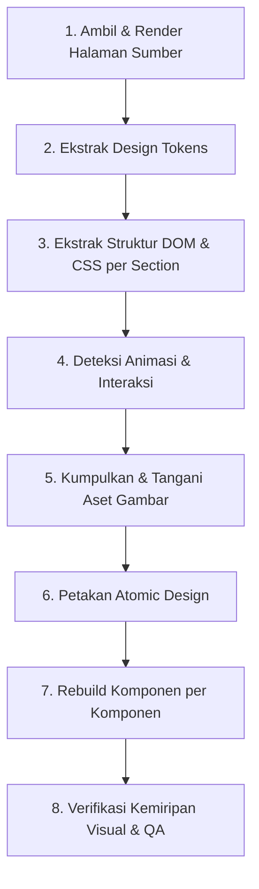

# 🌐 Web UI Clone (Front-End Visual & Atomic Cloner)

Skill untuk mereplikasi tampilan front-end sebuah website dari sebuah URL atau dokumen desain menjadi kode frontend modern (HTML/CSS/JS, React, atau Next.js + Tailwind CSS) yang mendekati 100% identik secara visual dan interaktif dengan sumber aslinya.

---

## ⚠️ Batasan Penting (Ethical & Legal Scope)

- Skill ini mereplikasi **kode dan tampilan front-end** (struktur DOM, CSS, JS interaksi, layout, warna, font, animasi) — bukan alat untuk membajak konten berhak cipta orang lain (teks editorial, foto stok berlisensi, logo brand, merek dagang) untuk dipublikasikan ulang sebagai milik sendiri.
- Gunakan untuk: website milik sendiri, proyek dengan izin eksplisit dari pemiliknya, keperluan belajar/prototyping internal, atau rebuild UI internal (redesign, migrasi framework, benchmark kompetitor secara internal).
- Jika target adalah website pihak lain yang aktif diperjualbelikan/berlisensi, pastikan user memiliki hak sebelum mempublikasikannya.
- Gambar/logo/foto yang jelas bermerek dagang atau berlisensi pihak ketiga sebaiknya ditandai sebagai placeholder di kode, atau digenerate ulang pengganti bebas lisensi via `generate_image`, kecuali user mengonfirmasi itu aset mereka sendiri.

---

## 🚀 Ringkasan Alur Kerja (Workflow)

Jalankan **Langkah 1–5** sebagai fase "Audit & Ekstraksi", lanjut ke **Langkah 6–7** sebagai fase "Atomic Rebuild", dan tutup dengan **Langkah 8** sebagai fase "Verifikasi & QA".

---

## 📋 Langkah 1 — Ambil & Render Halaman Sumber

1. **Pengambilan Konten**:
   - Gunakan `read_url_content` untuk mengambil struktur HTML mentah, metadata, link stylesheet eksternal, dan font.
   - Gunakan `browser_subagent` jika membutuhkan rendering visual penuh, inspeksi computed styles, state hover/drawer dinamis, atau screenshot layout.
2. **Analisis Metadata**:
   - Periksa tag `<title>`, `<meta name="theme-color">`, Open Graph image, serta favicon.
3. **Deteksi Framework & Library**:
   - Identifikasi signature class (misalnya `tailwind`, `bootstrap`, `mui`), font library (Google Fonts, Adobe Typekit), dan bundler yang digunakan.

---

## 🎨 Langkah 2 — Ekstrak Design Tokens

Dari stylesheet (`<style>`, file `.css`, atau CSS custom properties `:root`), kumpulkan dan susun daftar token:

- **Warna**: `primary`, `secondary`, `accent`, `background` (termasuk gradient stops), `surface`, `text-heading`, `text-body`, `border`, serta state (`hover`, `active`, `focus`). Simpan nilai HEX / HSL asli.
- **Tipografi**: `font-family` per hierarki (heading, body, code), scale ukuran (`text-xs` hingga `text-6xl`), `font-weight` (300 s/d 900), `line-height`, dan `letter-spacing`.
- **Spacing & Layout**: Grid dasar (4px/8px), `max-width` container (`max-w-7xl`, `max-w-6xl`), gutter, padding vertikal section.
- **Radius & Shadow**: `border-radius` (card, button, input pill/rounded-xl), layer `box-shadow` dan elevasi permukaan (glassmorphism/backdrop blur).

Simpan token ini di file konfigurasi tema (`tailwind.config.ts` atau `:root` di `globals.css`).

---

## 🧱 Langkah 3 — Ekstrak Struktur DOM & CSS per Section

Pecah halaman menjadi section logis vertikal:
1. **Announcement Bar**: Promo, badge update, countdown timer.
2. **Navbar**: Logo (SVG), navigasi links, dropdown/mega-menu, CTA button, dan responsive hamburger drawer.
3. **Hero Section**: Eyebrow badge, H1 Headline besar, subheadline, call-to-action buttons, hero mockup/graphic.
4. **Social Proof / Logo Bar**: Client logos, mitra, statistik, press badges.
5. **Feature / Bento Grid**: Kartu fitur dengan icon, gradient ring, hover scale, dan preview mockup.
6. **Social Proof & Testimonials**: Testimonial card, review ratings, avatar.
7. **Pricing Table**: Switcher bulanan/tahunan, tier kartu harga, list checklist fitur.
8. **FAQ Accordion**: Pertanyaan umum dengan expand/collapse interaktif.
9. **Final CTA Banner**: Form pendaftaran / newsletter lead-capture.
10. **Footer**: Navigasi sitemap, social icons, newsletter form, copyright & legal.

---

## ⚡ Langkah 4 — Deteksi Animasi & Interaksi

Scan CSS dan interaksi halaman untuk mereplikasi motion secara ringan:
- **Transisi & Hover**: `hover:scale-105`, `hover:shadow-lg`, transisi warna tombol.
- **Sticky Blur Navbar**: Transisi background dari transparan menjadi `bg-white/80 backdrop-blur-md` saat scroll `window.scrollY > 20`.
- **Accordion Smooth Transition**: Animasi ekspansi FAQ menggunakan CSS Grid (`grid-rows-[1fr]` vs `grid-rows-[0fr]`) atau Framer Motion.
- **Marquee / Slider**: Infinite logo ticker (`animate-marquee` dengan jeda saat hover).
- **Parallax & Reveal**: Reveal on scroll menggunakan Intersection Observer atau Framer Motion viewport triggers.

---

## 🖼️ Langkah 5 — Kumpulkan Aset Gambar & Vector

1. **Ikon & Logo**: Ekstrak sebagai raw inline SVG bersih atau gunakan icon pack terstandar (misalnya `Lucide React`).
2. **Gambar Bebas / Milik Sendiri**: Simpan langsung ke folder `public/images/` atau `assets/`.
3. **Placeholder & Gambar Alternatif**:
   - Jika aset asli terproteksi copyright atau beresolusi rendah, buat pengganti berkualitas tinggi menggunakan `generate_image` dengan dimensi & komposisi serupa.
   - Tandai aset pihak ketiga dengan komentar placeholder jelas.

---

## 🧩 Langkah 6 — Petakan Atomic Design

Susun breakdown arsitektur komponen secara modular:
- **Atoms**: `Button`, `Input`, `Badge`, `Avatar`, `Icon`, `Divider`.
- **Molecules**: `FormField`, `FeatureCard`, `NavLink`, `StatItem`, `TestimonialCard`.
- **Organisms**: `Navbar`, `HeroSection`, `BentoGrid`, `PricingSection`, `FAQAccordion`, `Footer`.
- **Templates / Layout**: `RootLayout`, `MainContainer`, `SectionWrapper`.
- **Pages**: `src/app/page.tsx` atau `index.html`.

---

## 💻 Langkah 7 — Rebuild

### Pilihan Target Framework:

| Target | Kapan Digunakan | Catatan Arsitektur |
| :--- | :--- | :--- |
| **Next.js + Tailwind (Project File)** | Rekomendasi default untuk aplikasi web modern, full responsive, App Router, SSR/SSG. | `src/app/`, `src/components/`, `src/lib/constants.ts`, `tailwind.config.ts`. |
| **HTML5 / CSS / Vanilla JS** | Untuk deliverable statis standalone tanpa build step. | `index.html`, `style.css`, `main.js`. |
| **React (Vite / Single-file)** | Untuk komponen modular berbasis library React murni. | `src/components/`, Tailwind utility classes. |

### Urutan Eksekusi Rebuild:
1. Konfigurasi Token CSS & Tailwind (`globals.css` + `tailwind.config.ts`).
2. Buat sumber data terpusat di `src/lib/constants.ts` (menu, stats, cards, faqs).
3. Bangun Atom & Molekul komponen.
4. Rakit Organisme per Section.
5. Hubungkan semua section di `page.tsx`.
6. Terapkan animasi dan micro-interactions.

---

## 🔍 Langkah 8 — Verifikasi Kemiripan Visual & QA

Lakukan pengecekan menyeluruh sebelum finalisasi:
1. **Viewport Breakpoints**:
   - 📱 **Mobile (360px – 480px)**: Tidak ada horizontal scrollbar (`overflow-x: hidden`), hamburger menu bekerja mulus, font size proporsional.
   - 💻 **Tablet (768px – 1024px)**: Bento grid 2-kolom rapi.
   - 🖥️ **Desktop (1280px – 1440px+)**: Container terpusat (`max-w-7xl mx-auto`), spacing seimbang.
2. **Color & Typography Audit**: Nilai warna tombol, teks, heading, dan kontras WCAG sesuai sumber.
3. **Interactive Parity**: Semua dropdown, accordion, tab switcher, dan tombol CTA merespons klik dan hover.
4. **Dokumentasi Output**: Sampaikan deliverable dan ringkasan status replikasi kepada user.
